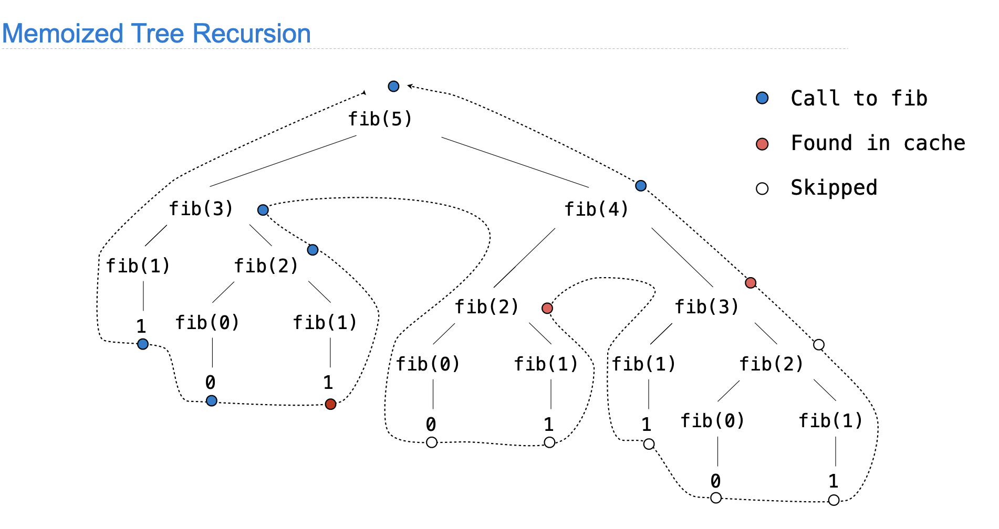
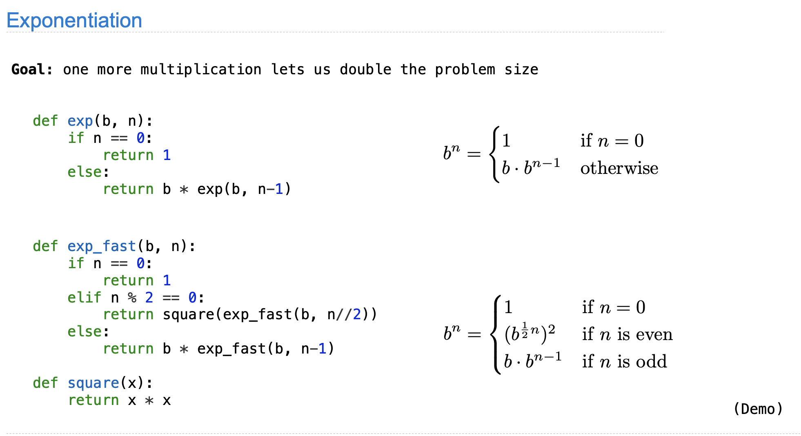
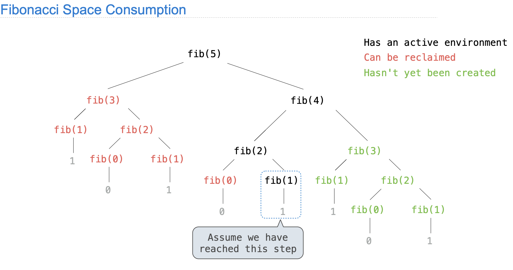

# Efficiency and  Modular design

### Efficiency

#### memorization 

- 统计调用fib函数的次数

``` python
def fib(n):
    if n == 0 or n == 1:
        return n
    else:
        return fib(n-2) + fib(n-1)
def count(f):
    def counted(n):
        counted.call_count += 1
        return f(n)
    counted.call_count = 0
    return counted		
```

- 优化——remember the result , 减少调用次数 f 要是pure funtion，否者会有不一样的行为 

​	`f` 要是pure funtion，否者会有不一样的行为 

``` python
def memo(f):
    cache = {}
    def memoized(n):
        if n not in cache:
            cache[n] = f(n)
        return cache[n]
    return memoized

fib = count(fib)
count_fib = fib
fib = memo(fib)    #fib = memorized
fib = count(fib)		# fib = counted
fib(30)
fib.call_count
#59
count_fib.call_count
#31
```

- **59 vs 31 :** 



#### exponentiation

讨论计算方法对效率的影响

​						

#### space

active environment : 当前栈 ； 依赖的 parent frame 

``` python
def count_frames(f):
    def counted(n):
        counted.open_count += 1
        counted.max_count = max(counted.max_count, counted.open_count)
        result = f(n)
        counted.open_count -= 1
        return result
    counted.open_count = 0
    counted.max_count = 0
    return counted
# fib = count_frames(fib)
# fib(20)  >>> 6765
# fib.open_count  >>> 0
# fib.max_count   >>> 20
```



---

### Modular design

``` python
def search(query, ranking=lambda r: -r.stars):
    results = [r for r in Restaurant.all if query in r.name]
    return sorted(results, key=ranking)

def reviewed_both(restaurant, other):
    return fast_overlap(restaurant.reviewers, other.reviewers)
    return len([r for r in restaurant.reviewers if r in other.reviewers])

def fast_overlap(s, t):
    """Return the overlap between sorted S and sorted T.

    >>> fast_overlap([2, 3, 5, 6, 7], [1, 4, 5, 6, 7, 8])
    3
    """
    count, i, j = 0, 0, 0
    while i < len(s) and j < len(t):
        if s[i] == t[j]:
            count, i, j = count + 1, i + 1, j + 1
        elif s[i] < t[j]:
            i += 1
        else:
            j += 1
    return count


class Restaurant:
    """A restaurant."""
    all = []
    def __init__(self, name, stars, reviewers):
        self.name = name
        self.stars = stars
        self.reviewers = sorted(reviewers) # sort 的目的是为了加速，
        Restaurant.all.append(self)

    def similar(self, k, similarity=reviewed_both):
        "Return the K most similar restaurants to SELF, using SIMILARITY for comparison."
        others = list(Restaurant.all)
        others.remove(self)
        return sorted(others, key=lambda r: -similarity(self, r))[:k]

    def __repr__(self):
        return '<' + self.name + '>'

import json

reviewers_by_restaurant = {}
for line in open('reviews.json'):
    r = json.loads(line)
    business_id = r['business_id']
    if business_id not in reviewers_by_restaurant:
        reviewers_by_restaurant[business_id] = []
    reviewers_by_restaurant[business_id].append(r['user_id'])


for line in open('restaurants.json'):
    b = json.loads(line)
    reviewers = reviewers_by_restaurant.get(b['business_id'], [])
    Restaurant(b['name'], b['stars'], reviewers)


results = search('Thai')
for r in results:
    print(r.name, 'is similar to', r.similar(3))
```

